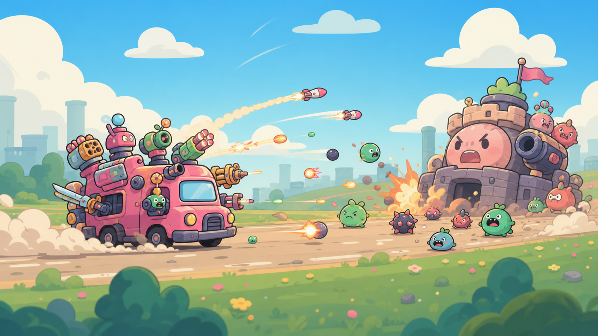

# Kaboom Caravan



> その火力で、前線を押し返せ。

かわいい装甲車へ過剰な火力を積み、敵との距離と前線を管理して戦うブラウザ向けローグライクです。戦闘後に装備を選び、同じ武器を重ねて強化しながら最終ボスを目指します。

[ブラウザで遊ぶ](https://ivgtr.github.io/kaboom-caravan/)

## 操作

`A` / `←` で後退、`D` / `→` で前進、`Space` で主武器、`C` で副武器、`F` で迎撃パリィ、左`Shift`で急加速。パリィは短い受付時間に敵の接触攻撃・弾を防ぎ、反撃・排熱・即時Cooldown回復を行います。タッチ操作は画面左右のボタンを長押しします。

戦闘中は`Esc` / `P`または「一時停止」ボタンで停止し、操作ガイドを確認できます。タブやウィンドウを離れても自動で停止します。「戦闘を再開」または`Esc` / `P`で明示的に再開するまで、戦闘・タイム計測は進みません。再開時は移動・射撃などを押し直してください。音声設定は停止前の状態を維持します。一時停止はセーブではなく、再読み込みすると進行は失われます。

報酬画面は`A` / `D`または`←` / `→`でカード移動、`Space` / `Enter`で決定、`1`〜`3`で直接選択できます。武器の装着先選択では`Esc`で戻れます。

## 前線突破：攻めて、好機を選ぶ

25mより前で敵に命中させると突破ゲージが増加します。25〜44mでは+6、45〜64mでは+9、65m以降では+12（命中による加算は0.75秒に1回まで）。パリィ成功はどの位置でも+25。空撃ち・待機では増えず、散弾や範囲攻撃の同時命中でも加算は1回です。

100%になったら `E` または「前線突破」ボタンを**1回押して**発動。敵弾を一掃し、敵を押し返して攻撃予備動作を中断、前線を8回復します。両武器の熱・Cooldownも解消し、4秒間は連射速度が1.75倍、排熱速度が2.5倍になります。**弾薬・エネルギーは通常どおり消費し、無敵にもなりません。** ボスへの押し戻しは小さくなります。

押し込むために使うか、過熱や敵弾への切り返しに残すかを選んでください。未使用ゲージは次戦へ持ち越せますが、発動中は再チャージできず、強化時間は次戦へ持ち越しません。敵も敵弾もない間は発動しません。キーを押したまま満タンになっても自動発動せず、改めて押す必要があります。一時停止・武器箱選択中は強化時間も停止します。

## 改造コア：この遠征の戦い方を選ぶ

第1戦を制圧すると、遠征中の戦い方を変える改造コアを1つ選べます。**この後に通常の戦利品も選べ、モジュール枠は消費しません。**

- **連携機関**：主副を片方ずつ交互に撃つ。2.5秒以内の切り替えで斉射威力1.6倍、直前の武器を18排熱。同時押しは連携を解除します。
- **展開砲座**：25m以降で1.5秒静止すると、斉射威力1.5倍・発熱30%減。移動操作や惰性移動で解除され、無敵にはなりません。
- **反攻蓄電器**：パリィ成功で、次の斉射の威力を2.5倍にする反攻弾を1回分装填。3秒で失効。同時射撃は主武器優先なので、重い副武器へ使うなら主武器を止めて合わせましょう。

追加キーはありません。弾薬・電力・Cooldownは通常どおり消費します。コア名と発動状況は戦闘HUD、詳しい条件は一時停止の操作ガイドで確認できます。報酬画面には選んだコアに合う装備のヒントも表示します。

選んだコアは遠征終了まで変更できません。種類は次戦へ持ち越しますが、連携・展開・反攻弾の一時状態は次戦でリセットされます。武器箱選択・一時停止中は状態と時間を保持します。新しい遠征では未選択に戻ります。詳しい仕様・確認手順は [改造コア](docs/combat-cores.md) を参照してください。

## 寄り道の拠点：回復も装備も、戦場で取りに行く

第4・7戦の前は、通常の街道、強敵、整備所、物資庫を比較して選べます。敵偵察・次戦の開始耐久・選択中のコアを見て、消耗を避けるか、追加の敵を引き受けて報酬を狙うか判断しましょう。最終戦は街道と整備所の2択です。

整備所は**18秒以内に37〜53mを累計3秒確保すると耐久+40**。物資庫は**20秒以内に57〜73mを累計4秒確保すると武器箱3択＋お宝2個**。選ぶだけでは報酬を得られず、それぞれ追加の守備隊が出現します。範囲内に敵がいる間は確保が止まり、退いても進捗は残ります。移動・射撃・パリィはそのまま使えます。

前線突破で場所を作る、砲座で守る、危険なら断念する。期限内に敵部隊・敵弾を全滅させても回収成功になり、空の戦場で待つ必要はありません。時間切れでも通常戦闘は続きます。停止・武器箱選択中は期限も止まります。詳細は [寄り道の戦場拠点](docs/battlefield-objectives.md) を参照してください。

## Post-MVP Alpha

- 3種類の初期Loadoutと、ラン実績によるExplosive Loadout解禁
- 同一Weaponの再取得によるLv.1〜3強化と固有挙動の変化
- Monsterから落ち、Caravanへ吸着するTreasureとReward Rarity／Reroll
- Battle 4・7・10前の進路比較と、守備隊のいる拠点を確保する修理／物資回収
- Best Time、直近Run、累計Treasureを保存する軽量Meta Progression
- 射撃・命中・Parry・Treasure・決着のAudioとMute切替
- 第1戦後に選び、交互射撃・定点砲撃・迎撃反攻へ戦い方を分ける改造コア
- 前線での命中・パリィから獲得し、任意発動する前線突破
- 戦闘の手動／自動一時停止と、停止中に読める操作ガイド

## 開発

Node.js 24以降を使用します。

```bash
npm ci
npm run dev
```

```bash
npm run check
npx playwright install chromium
npm run test:e2e
```
